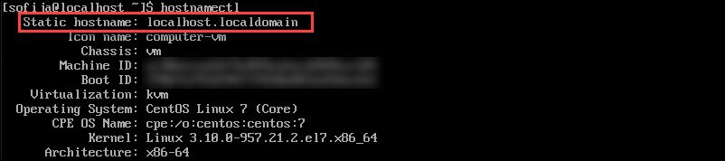

<script type="text/javascript">(function(w,s){var e=document.createElement("script");e.type="text/javascript";e.async=true;e.src="https://cdn.pagesense.io/js/webally/f2527eebee974243853bcd47b32631f4.js";var x=document.getElementsByTagName("script")[0];x.parentNode.insertBefore(e,x);})(window,"script");</script>


A hostname is simply the name a server goes by on a network. Setting a unique hostname is an excellent way to quickly find and identify different servers on your network.

## There are three 3 types of host names

1. The **static hostname** is the most important one, and it’s stored in the `/etc/hostname` file. This hostname is used among machines to identify a particular server.
2. The **pretty hostname** got its name because it allows for more characters and punctuation. It’s more user-friendly, but since it uses non-standard characters, it is not permitted for machine code. The pretty hostname is stored in the **/etc/machine-info** directory.
3. The **transient hostname** is one maintained in the Linux kernel. It is dynamic, meaning it will be lost after a reboot. This approach might be useful if you have a minor job requiring a temporary hostname, but you don’t want to risk making a permanent change that might be confusing.
how to set or change hostname in centos guide

## Prerequisites

- Server running CentOS 7
- Access to a user account with root privileges
- Terminal window (Menu > Applications > Utilities > Terminal)
- A text editor, like Vim

## How to Change Centos Hostname

### Step 1: Check Existing Hostname

Before you start, it is advised to check what your current hostname is. Type the following command in the console to find out:

```shell
hostnamectl
```

The output should return the static hostname, as well as a list of other information about your network configuration and operating system.

check static hostname on centos



### Step 2: Set a New Static Hostname

As `CentOS 7` only allows Fully Qualified Domain Names (`FQDNs`), double-check the hostname you plan to use.

### Acceptable values include

- Lower-case letters a to z
- Numbers 0 to 9
- Periods and hyphens
- Hostnames must be between 2 and 63 characters
- Hostnames must start and end with a number or letter
- Type in the following command in the terminal:

```shell
hostnamectl set-hostname my.new-hostname.server
```

**Note:** Make sure to replace my.new-hostname.server with your chosen hostname.

### Step 3: Check the Hostname

Next, verify the hostname by using the following command again:

```shell
hostnamectl
```

The console should display the new hostname.

### Step 4: Edit the /etc/hosts File

Start by opening the hosts file by typing:

```shell
sudo nano /etc/hosts
```

In the text editor, look for the line that begins with `127.0.0.1` (the IP address that refers to the system you are working on). It should read:

```shell
127.0.0.1  localhost localhost.localdomain localhost 4 localhost4.localdomain4 old.hostname
```

Change the entry old.hostname to my.new-hostname.server – and spell it the same as in Step 2.

Save the file and exit.

**Note:** To learn more about hosts file, check out our article on how to edit hosts file on Linux, Windows and Mac.

### Step 5: Reboot and Check CentOS 7 machine hostname

Restart your system. Open a console window, and run:

```shell
hostnamectl
```

It should display your new hostname.

You can also use your text editor to open and verify your `/etc/hostsfile`. It should still have your new hostname listed.

### Step 6 (Optional): Using a Pretty Hostname

To use a "pretty" hostname type the following command:

```shell
hostnamectl set-hostname "My Boss's Hostname"
```

- Make sure you have the quotation marks.
- Once that completes, check the hostname:

```shell
hostnamectl status
```

The console should return a list of information. Check the Static hostname and Pretty hostname lines – they should look like this:

- Static hostname:  `mybossshostname`
- Pretty hostname:  `My Boss's Hostname`

By putting the hostname in quotes, you’re telling the system to use the complex characters inside the quotes as a pretty hostname.

This enables you to avoid character restrictions for static hostnames.

using a pretty name on centos
But you still need a FQDN hostname for the machine to understand. Fortunately, CentOS is smart enough to remove or change any unacceptable characters and render the `static` hostname automatically.

### Step 7 (Optional): Setting a Transient Hostname

Fist, open the console and type the following:

```shell
sudo hostnamectl -transient set-hostname temporary.hostname
```

You can check the hostname in the same way you did earlier, with the hostnamectl or hostnamectl status command.

This change will last until you reboot the machine.

You can use this command with any type of hostname (`Static`, `Pretty`, or `Transient`) as an option with the double-hyphen.

Just use the double-hyphen to indicate what you want:

```shell
sudo hostnamectl --prettyset-hostname "Pretty Hostname"
```

or

```shell
sudo hostnamectl --staticset-hostname temporary.hostname
```
