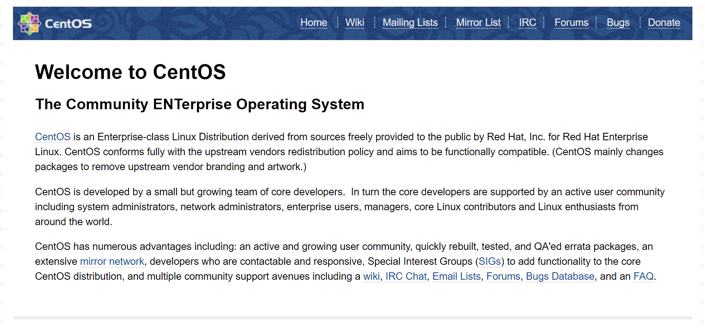

<script type="text/javascript">(function(w,s){var e=document.createElement("script");e.type="text/javascript";e.async=true;e.src="https://cdn.pagesense.io/js/webally/f2527eebee974243853bcd47b32631f4.js";var x=document.getElementsByTagName("script")[0];x.parentNode.insertBefore(e,x);})(window,"script");</script>


## Step One—Add Nginx Repository

To add the CentOS 7 EPEL repository, open terminal and use the following command:

```shell
sudo yum install epel-release
```

## Step Two—Install Nginx

Now that the Nginx repository is installed on your server, install Nginx using the following yum command:

```shell
sudo yum install nginx
```

After you answer yes to the prompt, Nginx will finish installing on your virtual private server (VPS).

## Step Three—Start Nginx

Nginx does not start on its own. To get Nginx running, type:

```shell
sudo systemctl start nginx
```

However I got the following error:
`Unregistered Authentication Agent for unix-process:11220:2470754`

This seems to be an SELinux Issue, and since I don't have a read need for SELinux, I will just disable is:
[Disable SELinux](selinux.md)

But that did not fix the problem either, so in the end it was because both NginX and Apache wants to use Port 80 and Apache was already using it. For now I'm leaving this as is, I will figure out later how to run both at the same time or I will set NginX to listen on a different port

If you are running a firewall, run the following commands to allow HTTP and HTTPS traffic:

```shell
sudo firewall-cmd --permanent --zone=public --add-service=http 
sudo firewall-cmd --permanent --zone=public --add-service=https
sudo firewall-cmd --reload
```

You can do a spot check right away to verify that everything went as planned by visiting your server’s public IP address in your web browser (see the note under the next heading to find out what your public IP address is if you do not have this information already):

`http://server_domain_name_or_IP/`
You will see the default CentOS 7 Nginx web page, which is there for informational and testing purposes. It should look something like this:



If you see this page, then your web server is now correctly installed.

Before continuing, you will probably want to enable Nginx to start when your system boots. To do so, enter the following command:

```shell
sudo systemctl enable nginx
```

## How To Find Your Server’s Public IP Address

To find your server’s public IP address, find the network interfaces on your machine by typing:

```shell
ip addr
```

```shell
1. lo: <LOOPBACK,UP,LOWER_UP> mtu 65536 qdisc noqueue state UNKNOWN

. . .
2: eth0: <BROADCAST,MULTICAST,UP,LOWER_UP> mtu 1500 qdisc pfifo_fast state UP qlen 1000

. . .
```

You may see a number of interfaces here depending on the hardware available on your server. The `lo` interface is the local loopback interface, which is not the one we want. In our example above, the `eth0` interface is what we want.

Once you have the interface name, you can run the following command to reveal your server’s public IP address. Substitute the interface name you found above:

```shell
ip addr show eth0 | grep inet | awk '{ print $2; }' | sed 's/\/.*$//'
```

## Server Root and Configuration

If you want to start serving your own pages or application through Nginx, you will want to know the locations of the Nginx configuration files and default server root directory.

## Default Server Root

The default server root directory is `/usr/share/nginx/html`. Files that are placed in there will be served on your web server. This location is specified in the default server block configuration file that ships with Nginx, which is located at `/etc/nginx/conf.d/default.conf`.

## Server Block Configuration

Any additional server blocks, known as Virtual Hosts in Apache, can be added by creating new configuration files in `/etc/nginx/conf.d`. Files that end with `.conf` in that directory will be loaded when Nginx is started.

## Nginx Global Configuration

The main Nginx configuration file is located at `/etc/nginx/nginx.conf`. This is where you can change settings like the user that runs the Nginx daemon processes, and the number of worker processes that get spawned when Nginx is running, among other things.
