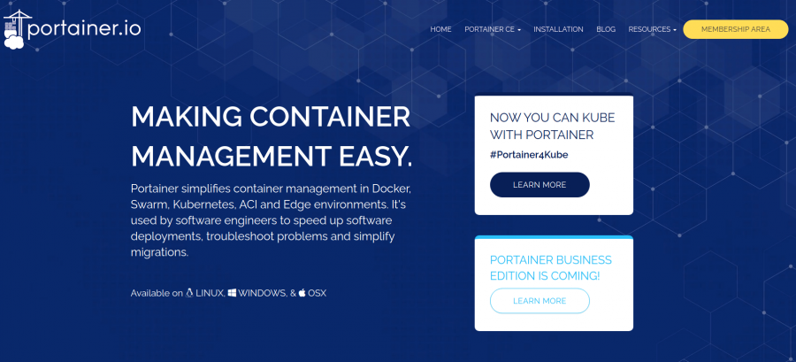
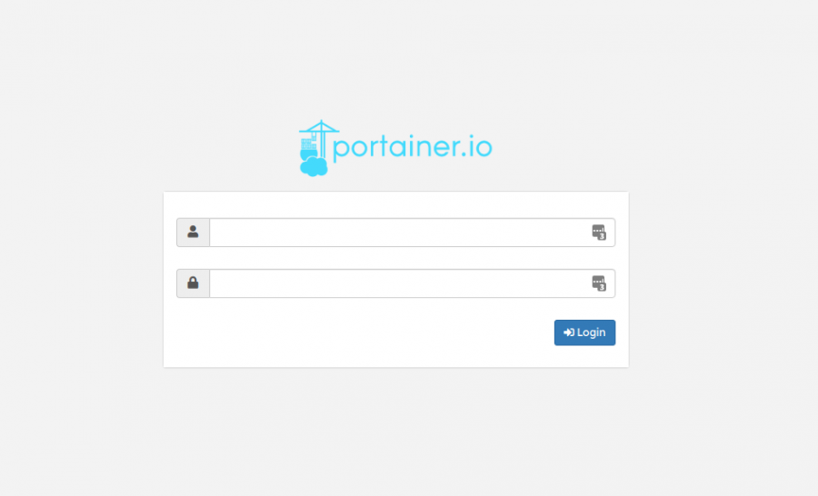
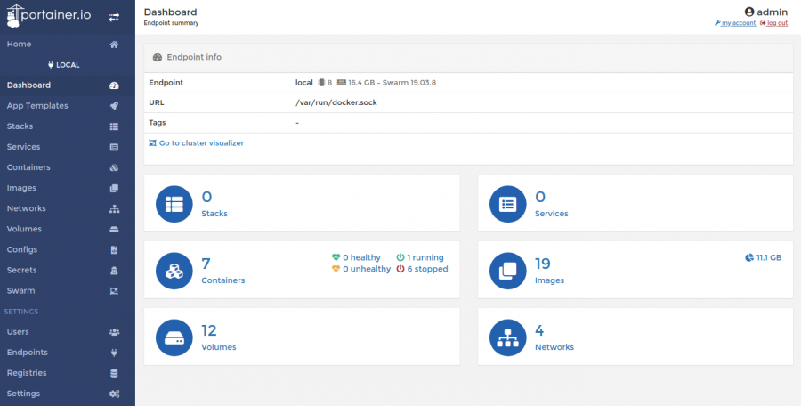
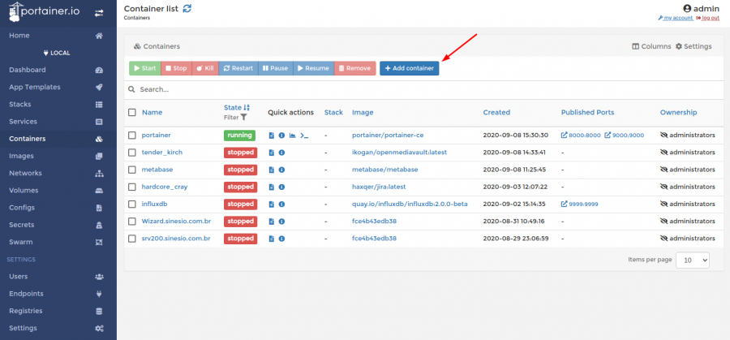
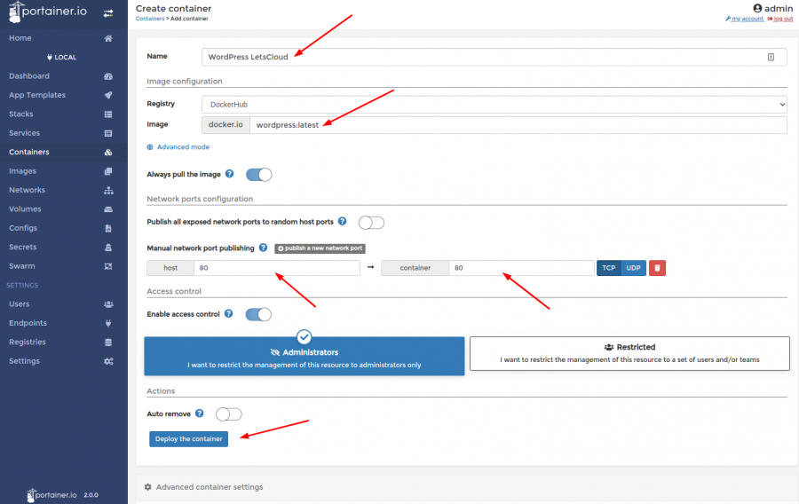
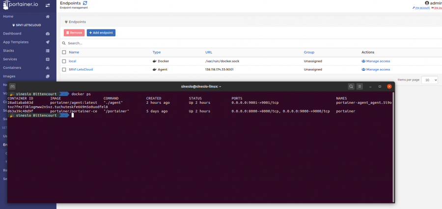

<script type="text/javascript">(function(w,s){var e=document.createElement("script");e.type="text/javascript";e.async=true;e.src="https://cdn.pagesense.io/js/webally/f2527eebee974243853bcd47b32631f4.js";var x=document.getElementsByTagName("script")[0];x.parentNode.insertBefore(e,x);})(window,"script");</script>

## Prerequisites

- Centos 7.x, Centos 8.x, Ubuntu 18.04, Ubuntu 20.04
- Commands and instructions may vary slightly on other CentOS 7 releases and Linux distributions.
- 1024MB or above Ram.
- 20GB Disk Space.
- 1 vCPU or above CPU.
- Docker engine running on target host – Can be local or remote
- Linux, macOS or Windows docker host machine
- Internet connection to download Portainer docker image

## What Portainer can do

- Manage Docker images – pull, delete, Build
- Quickly deploy applications from app templates
- Manage containers – start, stop, kill, restart, pause, resume, remove, create
- Manage networks – add, remove, edit
- Manage Volumes – add, remove, manage permissions
- Check docker engine events
- Add custom docker registry and add authentication for docker hub
- Create endpoints
- Add users to manage Docker
- Manage Docker swarm
- Create custom container templates

## Installing Portainer

### Step 1 - First step

Access the website [portainer.io](http://portainer.io) and then the [installation](https://www.portainer.io/installation/) option



Create a volume for Portainer with the following command

```shell
docker volume create portainer_data
```

After the volume has been created, run the command below on your terminal:

```shell
# Usage: docker run [OPTIONS] IMAGE [COMMAND] [ARG...]
sudo docker run -d -p 9000:9000 -v /var/run/docker.sock:/var/run/docker.sock -v portainer_data:/data portainer/portainer
```

We will use the latest version of portainer.io which is 2.0, the above command is from Docker I am considering that you already have experience with the basic commands.

```shell
# Commands Docker basics:

systemctl start/stop docker     # start/stop docker service
systemctl enable docker         # enable docker running when OS start
docker pull                     # pull Docker image
docker ps                       # list all running Containers 
docker ps -a                    # list all Containers
docker start/stop CONTAINER ID  # start/stop Container            
docker rm CONTAINER ID          # delete Container by ID
docker kill CONTAINER ID        # shut down Container
docker images                   # list all images have been downloaded
```

### Step 2 - Check if portainer.io is running on Docker

Ready your [portainer.io](Portainer.io) is already installed and running on its default port which is [SERVER_IP: 9000]([http://server_ip:9000/]([http://server_ip:9000/)) as you can see in our image.

[img2](portainer/2png.png)

[Portainer.io](Portainer.io) has several services that can help us in our daily lives, such as:

[Portainer CE for Kubernetes](https://www.portainer.io/portainer-ce/portainer-ce-for-kubernetes/)
[Portainer CE for Swarm](https://www.portainer.io/portainer-ce/portainer-ce-for-swarm/)
[Portainer CE for Edge](https://www.portainer.io/portainer-ce/portainer-ce-for-edge/)
[Portainer CE for ACI](https://www.portainer.io/portainer-ce/portainer-ce-for-acis/
)
But we are not done here! I will show some functions inside the panel if your Docker is working correctly to access the UI by typing the following in your browser.

```shell
SERVER_IP:9000
```

Note. `SERVER_IP` is the address of the Docker server

The first step will be like basic settings which, in general, is fast, you will have to define an administrator password and the environment you want to control, choose the local environment.

### Step 3 - Accessing the panel

After making the initial settings, you will see the following image in your browser:



```shell
Imagem portainer
```

In the Portainer home screen, all Endpoints (environments) configured will appear. In my configuration, I will have two, one corresponding to the local environment and another environment that is connected to the [LetsCloud](https://www.letscloud.io/referral/TK9AJBANYI).


In your case, select the local Endpoint to view your portainer.io.



On my initial Dashboard, I can see my stacks, containers, volumes, services, images and networks. In this post, we will focus on containers and how to connect in a second environment (Endpoints).

### Step 4 - Downloading and configuring Docker image on your Portainer

In our first example, we will use the **WordPress** installation, where we will do the initial setup on the dashboard our portainer.io.

After selecting the option containers we will see the following screen:



Then portainer.io will present the following screen:



Name: define the name of your container Image: Name of the image in DockerHub Configuration of network ports: I suggest you enable the option to Publish all exposed network ports and then set port 80 manually, as shown in the image above.

### Step 5 - Deploying

Click Deploy the container to start downloading the image and then start your container automatically.


If everything works as expected, you will see WordPress container running on port 80. Use your browser to view the WordPress Welcome page.

```shell
SERVER_IP:80
```

### Step 6 - Endpoints

We arrived at the second and last part of our post, but don't stop here portainer.io has many functions to be explored!



After you select the option endpoints we will have some options like:

Agent - Portainer agent Edge Agent - Portainer Edge agent Docker - Directly connect to the Docker API Azure - Connect to Microsoft Azure ACI

In our tutorial, we will only use Agent and for that, we need to run the agent on our second docker that is in our cloud on LetsCloud.

### Step 7 - Installing the Agent

```shell
curl -L https://downloads.portainer.io/agent-stack.yml -o agent-stack.yml && docker stack deploy --compose-file=agent-stack.yml portainer-agent
```

Note. Just to remember, you must have Docker working at the destination!

Ready! If everything goes as expected, the agent will appear as running on your docker.


To test the functioning of your new machine, go to your portainer.io home screen.


Access the machine you just connected and repeat our installation of WordPress on the second machine.

- So, did you like the content? You can't help but know how to update WordPress, as updates are an important part of system security, they improve performance and bring new features. Also, updating your site requires only a few clicks. It's simple, fast and essential!
- Last tip: Before starting a project in production with portainer.io, research the limitations of your UI and if it will meet all your needs in the course of the project.
- A very good place to search is the official forum, he also has Blog, channels on, Discord and a good documentation.
- The hello-world container is only a simple container used to verify if the Docker engine is working correctly in the system and if the Portainer can start a container on the board. We will build more complex containers in the next sections.

## Update Portainer

### Remove Prev Version

```shell
docker stop portainer
docker rm portainer
```

If it is not finding the portainer images, then they probably running the portainer with a custom name image on a custom, name, run the following running on a command:

```shell
docker ps -a
```

You can then stop the container referring to it's name

```shell
docker stop [name]
docker rm [name]
```

Now that you have stopped and removed the old version of Portainer, you must ensure that you have the 

latest version of the image locally. You can do this with a docker pull command:

```Shell
docker pull portainer/portainer-ce:2.11.0
```

Finally, deploy the updated version of Portainer, or read next paragraph for SSL

```shell
docker run -d -p 9000:9000 -p 9443:9443 \
    --name=portainer --restart=always \
    -v /var/run/docker.sock:/var/run/docker.sock \
    -v portainer_data:/data \
    portainer/portainer-ce:2.11.0
```

To provide your own SSL certs you may use --sslcert and --sslkey flags as below to provide the certificate and key files. The certificate file needs to be the full chain and in PEM format.

```shell
# This did not work for me, so I removed the container again and ran the command above and it worked
docker run -d -p 8000:8000 -p 9000:9000 -p 9443:9443 \
    --name=portainer --restart=always \
    -v /var/run/docker.sock:/var/run/docker.sock \
    -v portainer_data:/data \
    portainer/portainer-ce:2.11.0 \
    --sslcert /srv/cert/CRONje.ME_ssl_certificate.cer \
    --sslkey /srv/cert/_.CRONje.ME_private_key.key
```

The newest version of Portainer will now be deployed on your system, using the persistent data from the previous version, and will also upgrade the Portainer database to the new version.
When the deployment is finished, go to [https://your-server-address:9443](http://your-server-address:9000) or [http://your-server-address:9000](http://your-server-address:9000) and log in. You should notice that the update notification has disappeared and the version number has been updated.
