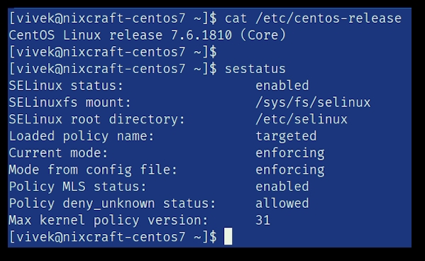
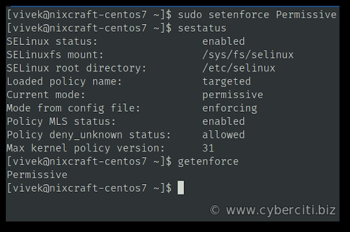
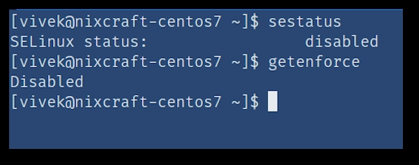

<script type="text/javascript">(function(w,s){var e=document.createElement("script");e.type="text/javascript";e.async=true;e.src="https://cdn.pagesense.io/js/webally/f2527eebee974243853bcd47b32631f4.js";var x=document.getElementsByTagName("script")[0];x.parentNode.insertBefore(e,x);})(window,"script");</script>


The procedure to remove and disable SELinux security features is as follows:

1. Log in to your server
2. Check the current `SELinux` status, run: `sestatus`
3. To disable SELinux on CentOS 7 temporarily, run: sudo `setenforce 0`
4. Edit the `/etc/selinux/config` file and set the `SELINUX` to `disabled`
5. `Reboot` the Linux server
6. Verify it by running the `sestatus` and `getenforce` again
7. let us see all commands, examples and usage in details.

## How to find out SELinux status on CentOS 7

Run the following `sestatus` command

```shell
sestatus
```



Another option is to run the following command to

## print the current mode of SELinux

```shell
getenforce
Enforcing
```

## Another option is to runt the following cat command

```shell
cat /etc/selinux/config

# Output
# SELINUX=enforcing
# SELINUXTYPE=targeted
```

## Different types of security policy

The `/etc/selinux/config` file controls the state of SELinux on the system. `SELINUX`= can take one of these three values:

`enforcing` – SELinux security policy is enforced.
`permissive` – SELinux prints warnings instead of enforcing (`disabled`).
`disabled` – No SELinux policy is loaded (`disabled`).
`SELINUXTYPE`= can take one of following:

`targeted` – Targeted processes are protected.
`minimum` – Modification of targeted policy. Only selected processes are protected.
`mls` – Multi Level Security protection.
`Warning`: The author does not recommend disabling SELinux and is not responsible for security problems on your Linux-based server

## Disable SELinux

You can modify the mode SELinux is running in using the setenforce command. For example, to put SELinux in enforcing mode, run:

```shell
sudo setenforce Enforcing
sestatus
```

To put SELinux in permissive mode i.e. disabled mode:

```shell
sudo setenforce Permissive
sestatus
getenforce
```



Please note that is temporary solution to disable SELinux without rebooting the server and active for the current session only. Hence, use the following method for disabling SELinux forever.

### Disabling SELinux permanently

Edit the `/etc/selinux/config` file, run:

```shell
sudo vi /etc/selinux/config
````

Set SELINUX to disabled:

```shell
SELINUX=disabled
```

Save and close the file in vi/vim. Reboot the Linux system:

```shell
sudo reboot
```

After reboot, make sure following commands gives Disabled output indicating that SELinux removed and disabled on your Linux server:

```shell
getenforce
sestatus
```


