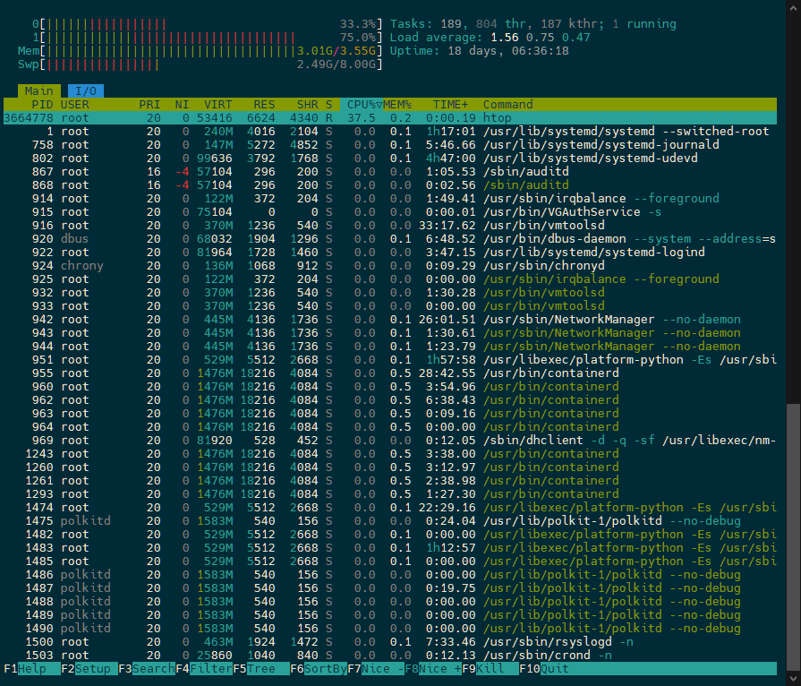

# Increase the size of the SWP file

This is a very quick process, run the following command to increase the swp file by 6gb

```sh
sudo fallocate -l 6G /swapfile && sudo chmod 600 /swapfile && sudo mkswap /swapfile && sudo swapon /swapfile && echo '/swapfile none swap sw 0 0' | sudo tee -a /etc/fstab
```

Output

```sh
Setting up swapspace version 1, size = 6 GiB (6442446848 bytes)
no label, UUID=b12568b0-38f2-47c7-922b-dad8c33102de
/swapfile none swap sw 0 0
```

To make sure use `htop`

```sh
htop
```



> Notice the swp file size is now 8gb from increased from 2gb
